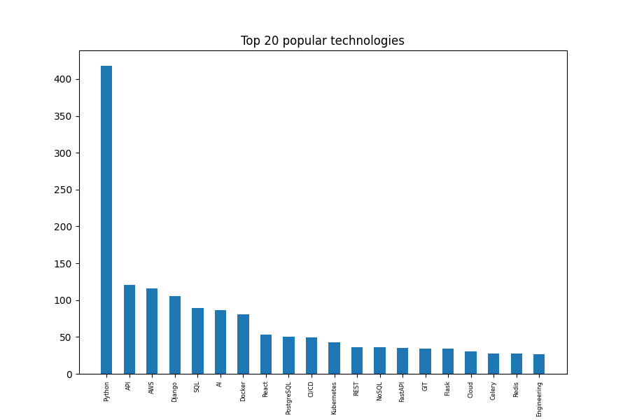
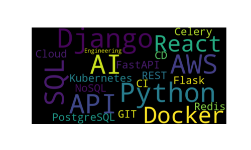

# Python technologies statistics

This project aims to provide insights into the most demanded technologies in the job market for Python Developers. By scraping job listings from Djinni, the project analyzes the frequency of technologies mentioned in the job descriptions, helping developers stay informed about the current tech trends.
This project combines web scraping and data analysis to provide statistics on the 
popularity of various technologies, based on Djinni job listings. 
This project combines web scraping and data analysis to provide statistics on the 
popularity of various technologies, based on Djinni job listings.

## Installing

```shell
git clone https://github.com/kleotan901/python_technologies_statistics.git
cd python_technologies_statistics
python -m venv venv
source venv/bin/activate
pip install -r requirements.txt

```

## Diagram of the 20 most popular technologies for Python developers



## Correlation
Correlation coefficients measure the strength and direction of a linear relationship 
between two variables, with values ranging from -1 to 1.


The correlation coefficient between "experience" and "views" is -0.57.
This is moderate negative correlation.
Which means that as "experience" increases, "views" tend to decrease, and vice versa.

The correlation coefficient between "experience" and "applications" is -0.49.
This is moderate negative correlation.
Which means that as "experience" increases, "applications" tend to decrease, and vice versa.

The correlation coefficient between "views" and "applications" is 0.87.
This is a strong positive correlation.
Which means that as "views" increases, "applications" tends to increase as well.


## Wordcloud
Wordcloud to display word occurrence frequency

